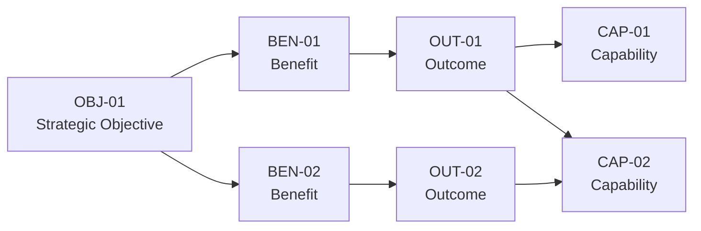

# Artefact 1 — Objective and Benefits Map

## Purpose

Create a shared causal model from **objective** through **benefit** and **outcome** to the capability changes that an intervention must enable.

This is the primary orientation artefact for Benefits Architecture.

## Minimum content

For each significant node, record:

- identifier;
- concise statement;
- owner where relevant;
- baseline / target where known;
- dependencies;
- material assumptions;
- material disbenefits.

## Basic pattern



The arrow means approximately:

> **The downstream change contributes causally to the upstream value.**

Do not imply stronger causality than the evidence supports.

## Workshop sequence

Work from left to right conceptually, but challenge the chain in both directions.

1. What is the objective?
2. What measurable advantage would demonstrate progress?
3. What outcome must change?
4. What behaviour or capability must become possible?
5. What other changes are required outside technology?
6. What assumptions connect each step?
7. What negative impacts could occur?
8. Who owns each benefit?

Only after this should architecture options become prominent.

## Copy/paste template

```markdown
# Objective and Benefits Map

## Objective

**ID:** OBJ-  
**Statement:**  
**Owner:**  
**Why now:**  
**Success horizon:**  

## Benefits

### BEN-01 — <name>

**Owner:**  
**Baseline:**  
**Target / range:**  
**Value type:**  
**Expected horizon:**  
**Confidence:**  
**Disbenefits:**  

## Outcomes

### OUT-01 — <name>

**Measure:**  
**Current state:**  
**Desired state:**  
**Contributes to:** BEN-  
**Assumptions:**  

## Capability changes

### CAP-01 — <name>

**Description:**  
**Required for:** OUT-  
**Technology required?** Yes / No / Unknown  
**Dependencies:**  
```

## Quality checks

A useful map should answer:

- Can each Benefit be traced to an Objective?
- Can each Benefit be traced downward to one or more Outcomes?
- Can each Outcome be connected to a plausible capability or behavioural change?
- Are technology products absent until the capability/intervention layer?
- Are owners visible?
- Are assumptions distinguishable from evidence?
- Are disbenefits visible?
