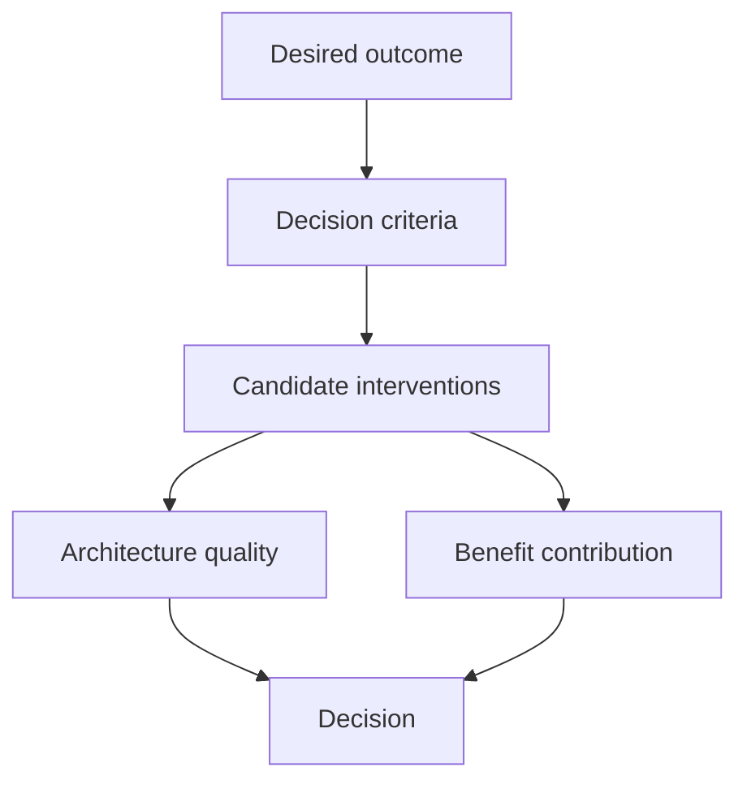

# Artefact 3 — Value-aware Architecture Decision Record

## Purpose

Extend a conventional ADR so that material architecture choices are evaluated against **business outcomes and benefit realisation**, not only technical qualities.

This does not replace normal architecture criteria or Well-Architected review.

## Decision model



## Copy/paste template

```markdown
# ADR-xxx — <Decision title>

**Status:** Proposed / Accepted / Superseded  
**Date:**  
**Decision owner:**  
**Architect:**  

## Context

What problem or decision exists?

## Value context

**Objective(s):** OBJ-  
**Benefit hypothesis(es):** BEN-  
**Outcome(s):** OUT-  
**Feature(s):** FEAT-  

## Constraints

- time
- budget
- regulatory
- security
- organisational capability
- existing technology
- data
- operational

## Options considered

### Option A — <name>

Description.

### Option B — <name>

Description.

### Option C — <name>

Description.

## Decision criteria

| Criterion | Weight / priority | A | B | C | Evidence / notes |
|---|---:|---:|---:|---:|---|
| Outcome contribution | | | | | |
| Time to first evidence | | | | | |
| Time to benefit | | | | | |
| Implementation cost | | | | | |
| Run cost | | | | | |
| Reversibility | | | | | |
| Measurement capability | | | | | |
| Reliability | | | | | |
| Security | | | | | |
| Operational excellence | | | | | |
| Performance efficiency | | | | | |
| Other | | | | | |

## Decision

We will ...

## Why this option now?

Explain both technical and value reasoning.

## Trade-offs accepted

-  

## Assumptions

-  

## Evidence plan

What will tell us whether the decision is helping the intended outcome?

## Reconsideration triggers

Revisit this ADR if:

-  
```

## Scoring warning

A numeric matrix supports discussion; it does not make a decision objective.

Keep narrative reasoning, uncertainty, non-negotiable constraints, and sensitivity visible.
