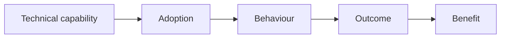
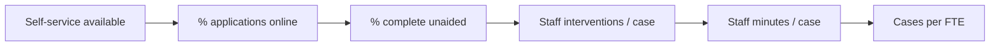

# Artefact 4 — Benefit Observability Model

## Purpose

Define the evidence needed to observe whether the causal chain from delivered technology to business benefit is actually occurring.

Benefit observability treats business-value evidence as an architecture concern.

## Evidence chain



Example:



## Copy/paste template

```markdown
# Benefit Observability Model — <scope>

**Objective:** OBJ-  
**Benefit:** BEN-  
**Outcome(s):** OUT-  

| Stage | Question | Measure | Source | Baseline | Target | Cadence | Owner |
|---|---|---|---|---:|---:|---|---|
| Technical | Does the capability work? | | | | | | |
| Adoption | Are intended users using it? | | | | | | |
| Behaviour | Are users/processes changing? | | | | | | |
| Outcome | Is the operational/user outcome moving? | | | | | | |
| Benefit | Is measurable value emerging? | | | | | | |

## Instrumentation requirements

- Application telemetry:
- Domain events:
- Operational system data:
- User analytics:
- Financial / capacity data:
- Survey / qualitative evidence:

## Data constraints

- privacy:
- retention:
- consent:
- access:
- data quality:
- attribution limitations:

## Diagnostic rules

If `<measure A>` improves but `<measure B>` does not, investigate ...

## Review cadence

- Sprint Review:
- monthly:
- quarterly:
```

## Microsoft-oriented implementation examples

Possible implementation mechanisms include:

- Azure Monitor and Application Insights;
- Log Analytics;
- custom application/domain events;
- Azure Data Explorer;
- Dataverse auditing or telemetry;
- Fabric / warehouse / lakehouse;
- Power BI semantic models and dashboards.

These are implementation choices. Define the evidence chain before choosing the telemetry stack.

## Observability principle

Do not jump straight from:

> Feature deployed

to:

> benefit realised.

Intermediate measures make causal failure diagnosable.
