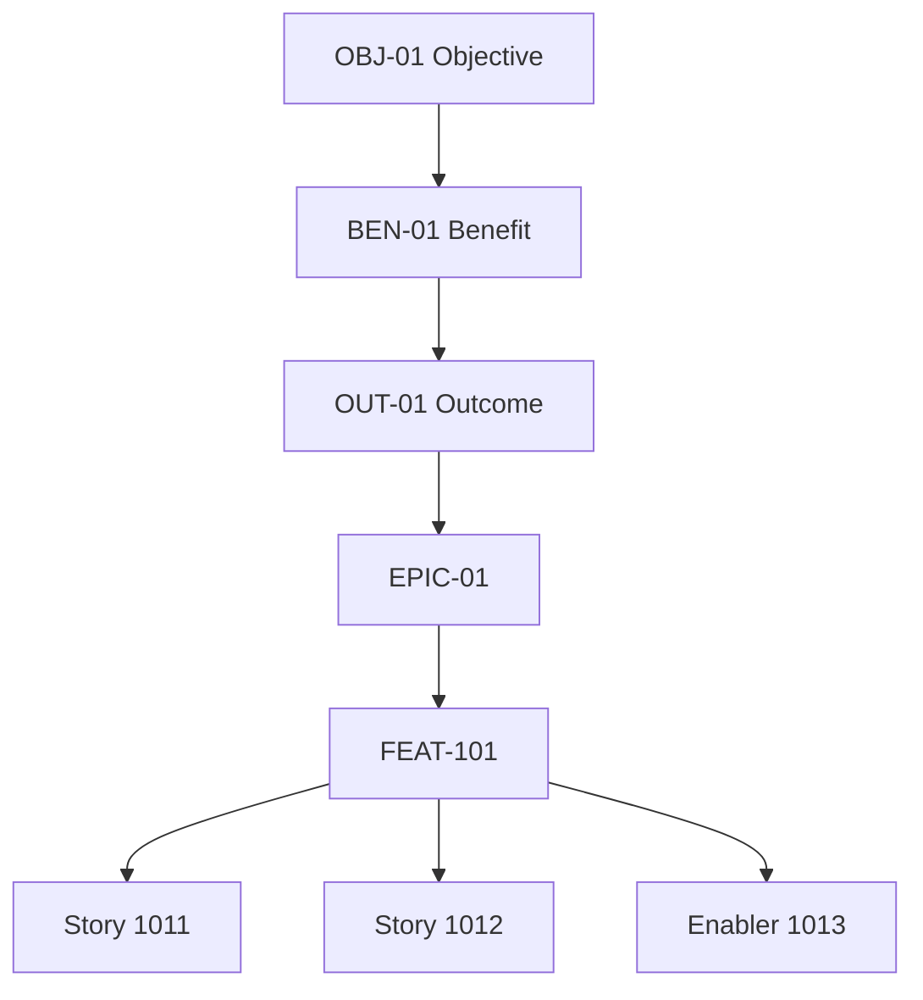

# Artefact 5 — Benefit-aware Backlog

## Purpose

Connect an existing product backlog to benefit and outcome traceability without creating a second backlog.

## Conceptual hierarchy



The exact physical work-item types are optional.

## Suggested Feature metadata

```markdown
# FEAT-xxx — <Feature name>

## Outcome context

**Outcome(s):** OUT-  
**Benefit hypothesis(es):** BEN-  
**Objective(s):** OBJ-  

## Intervention hypothesis

We believe this Feature will ...

## Users / actors

-  

## Success evidence

### Leading

-  

### Target / lagging

-  

## Architecture dependencies

- ADR-
- CAP-
- Enablers:

## Assumptions

-  

## Disbenefits / risks

-  

## Smallest evidence-generating slice

Describe the smallest production increment or experiment that can test a material assumption.
```

# Work-item rules

## Rule 1 — No orphan material Features

Every material Feature should trace to an outcome.

## Rule 2 — Do not monetise Stories artificially

A Story can inherit purpose from its parent Feature.

## Rule 3 — Enablers are legitimate

Technical work may exist several steps below a benefit. Maintain a credible chain rather than fabricating direct value.

## Rule 4 — Backlog order may reflect learning value

A lower-value Feature may be prioritised early if it cheaply resolves a high-risk assumption.

## Rule 5 — Prefer coherent Sprint Goals

Where practical, select PBIs that allow one meaningful Sprint Goal.

# Suggested Azure DevOps mapping

One lightweight option:

| Concept | Possible Azure DevOps representation |
|---|---|
| Objective | Epic, tag, wiki page, or external strategic item |
| Benefit Hypothesis | Markdown page / custom work item / linked record |
| Outcome | Feature field, tag or linked item |
| Epic | Epic |
| Feature | Feature |
| Story | User Story / Product Backlog Item |
| Enabler | User Story/PBI with `Enabler` tag or custom type |
| ADR | Repository Markdown linked from Feature |
| Evidence | Dashboard + Evidence Log link |

Do not add custom work-item types until the team can show that the metadata will genuinely be maintained.
