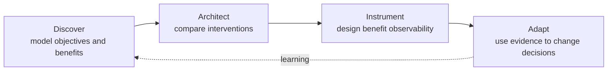

# Consulting Offering

This page translates the toolkit into a possible professional service description.

The wording is deliberately provisional.

## Positioning

### Benefits Architecture / Value-led Solution Architecture

> **Connect technology investment decisions to measurable business outcomes throughout Agile delivery.**

The service is intended for organisations that need to make or revisit significant technology choices while retaining traceability to business outcomes.

It is especially relevant where:

- a platform or product has been proposed before the problem is well framed;
- Azure, Power Platform, Dynamics 365, SaaS, or custom development are competing options;
- a business case contains benefits that are weakly connected to delivery;
- a Scrum team is delivering Features without strong outcome coherence;
- an architecture programme is technically governed but value measurement is weak;
- benefits are expected after go-live but the solution is not instrumented to observe them.

## Four service activities

### 1. Discover

Establish:

- objectives;
- benefit owners;
- benefit hypotheses;
- baselines;
- desired outcomes;
- dependencies;
- disbenefits;
- decision constraints.

Primary output:

- Objective and Benefits Map;
- Benefit Hypothesis cards.

### 2. Architect

Explore multiple interventions and make material technology choices using both architecture-quality and value criteria.

Primary output:

- option assessment;
- Value-aware ADRs;
- architecture traceability.

### 3. Instrument

Design evidence across:

- technical capability;
- adoption;
- behavioural change;
- operational outcome;
- realised benefit.

Primary output:

- Benefit Observability Model;
- telemetry / analytics requirements.

### 4. Adapt

Use empirical evidence during product delivery and operations to revisit:

- Features;
- architecture choices;
- benefit confidence;
- investment priority.

Primary output:

- Benefit Evidence Log;
- decision updates;
- revised backlog / ADRs where required.

## Possible engagement shapes

### Architecture Discovery

A short engagement before a major platform decision.

Useful when the client is asking:

> Should this be Dynamics, Power Platform, custom Azure, SaaS, or something else?

Outputs:

- outcome/benefit framing;
- candidate interventions;
- key assumptions;
- initial option assessment;
- recommendation for discovery spikes.

### Embedded Benefits Architect

Architect participates within an existing Scrum product team.

Responsibilities include:

- Benefit-aware Refinement;
- value-aware architecture decisions;
- Benefit Observability;
- evidence interpretation;
- architectural adaptation.

### Architecture and Value Review

A health check for an existing programme.

Questions include:

- Can every material Feature be traced to an outcome?
- Are claimed benefits measurable?
- Does the chosen architecture accelerate or delay realisation?
- Is telemetry capable of showing whether behavioural change occurred?
- Are platform decisions still justified by current evidence?
- Are technical enablers being mistaken for benefits?

## What this service does not replace

It does not replace:

- Sponsor accountability;
- Benefit Owners;
- Product Owner accountability;
- Scrum;
- PM / programme governance;
- specialist financial appraisal;
- business analysis;
- user research / service design;
- Azure or Power Platform Well-Architected review.

Its distinctive responsibility is:

> **maintaining the integrity, traceability, and observability of the technology-to-value argument.**

## Candidate customer-facing principles

These can be shared at engagement inception.

1. We start with value, not technology.
2. Benefits remain hypotheses until evidence supports them.
3. Every material Feature must advance an outcome.
4. Architecture optimises time-to-benefit as well as technical quality.
5. Important benefits must be observable.
6. Evidence can change architecture as well as backlog order.
7. Business owns benefits; architecture owns the integrity of the technology-to-value argument.
8. We prefer the smallest intervention capable of generating useful evidence.
