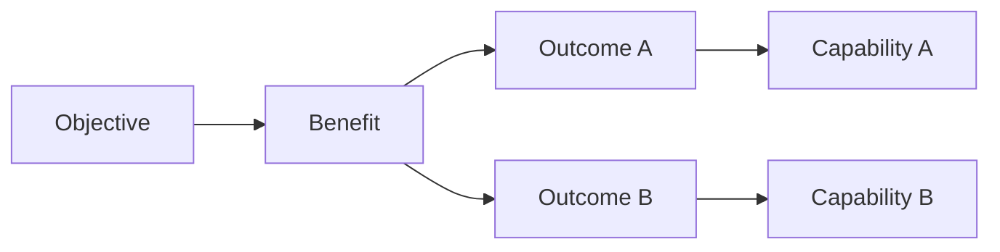
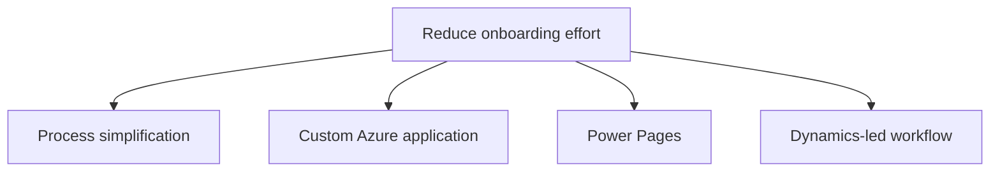

# Engagement Playbook

This page describes a lightweight way to introduce Benefits Architecture into a real engagement.

# 1. Establish the mandate

Agree that the architect is not taking ownership of business benefits.

Suggested engagement statement:

> The architecture work will maintain explicit traceability between business objectives, desired outcomes, technology interventions, architecture decisions, and observable evidence so that investment decisions can be adapted as the team learns.

Clarify:

- benefit owners;
- Product Owner;
- decision authority;
- existing BRM obligations;
- architecture governance;
- Scrum or delivery model;
- available operational data.

# 2. Run Benefit Framing

A first workshop should establish:

- objective;
- stakeholders;
- desired outcomes;
- material benefits and disbenefits;
- owners;
- baseline;
- target;
- assumptions;
- known dependencies;
- existing technology constraints.

Do not begin by whiteboarding products or Azure services.

## Prompt set

Useful questions include:

- What is unsatisfactory about the current state?
- What would stakeholders observe if this initiative succeeded?
- Which measurable outcomes would change?
- Who gains the advantage?
- What is the baseline?
- What is the target or acceptable range?
- What must people do differently?
- What other organisational changes are required?
- What would still prevent the benefit even if the software were perfect?
- How quickly must useful value begin to emerge?
- What evidence would make us stop or change direction?

# 3. Produce the initial map

Create only enough detail to support decisions.

Record unresolved assumptions explicitly rather than hiding uncertainty.

# 4. Establish baselines before solution design hardens

A benefit with no baseline is difficult to evaluate.

Where measurement does not yet exist, decide whether to:

- instrument the existing process;
- sample manually;
- use a proxy measure;
- derive a benchmark;
- treat the first release as a baseline-building experiment.

# 5. Explore interventions

For each important outcome, identify multiple possible interventions where credible.

Include non-technology options.

Example:

Do not compare detailed implementations before agreeing the decision criteria.

# 6. Make value-aware architecture decisions

Use a Value-aware ADR for material platform and architecture decisions.

Typical benefit-related criteria:

- time to first evidence;
- time to target benefit;
- expected contribution;
- implementation cost;
- run cost;
- change cost;
- lock-in / reversibility;
- adoption friction;
- measurement capability;
- delivery risk;
- WAF posture.

# 7. Shape the backlog

Ensure Features carry meaningful outcome traceability.

Avoid creating separate benefit-management work queues.

Where possible:

- Features carry benefit/outcome links;
- enablers link to the Feature they enable;
- Sprint Goals express coherent outcomes or learning;
- evidence work is part of Definition of Done or Feature acceptance where appropriate.

# 8. Instrument the causal chain

Create the Benefit Observability Model before production telemetry becomes expensive to retrofit.

Define:

- technical signals;
- adoption signals;
- behavioural signals;
- outcome signals;
- benefit measures;
- owner;
- source;
- cadence;
- privacy / retention constraints.

# 9. Inspect evidence

At Sprint Review, use evidence appropriate to the maturity of the intervention.

Early:

- prototype completion;
- usability;
- technical feasibility.

Middle:

- adoption;
- abandonment;
- operational errors;
- workload behaviour.

Later:

- process effort;
- cycle time;
- quality;
- cost;
- revenue;
- capacity;
- customer outcomes.

# 10. Revisit the intervention when necessary

A credible architect-led benefits method must make stopping or changing direction acceptable.

Possible decisions include:

- continue;
- simplify;
- expand;
- defer;
- change platform;
- remove a Feature;
- run an experiment;
- change process rather than software;
- terminate an intervention whose value case no longer survives.

# Suggested minimum engagement outputs

For a modest product engagement, the minimum set could be:

1. one Objective and Benefits Map;
2. Benefit Hypothesis cards for only the material benefits;
3. Value-aware ADRs for material choices;
4. one Benefit Observability Model;
5. benefit-aware Feature metadata in the existing backlog;
6. a running Benefit Evidence Log.

This is enough to make the approach visible without creating a parallel PMO.
