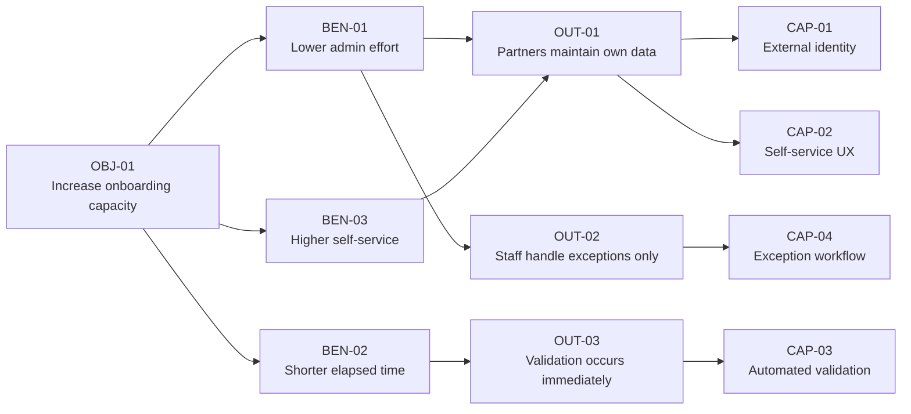

# Worked Example — External Partner Portal

This example demonstrates the toolkit using an Azure-oriented external onboarding problem.

The important point is that the solution is **not chosen at the beginning**.

# 1. Initial request

> We need a new external partner portal.

A technology-first project might immediately compare Power Pages, Dynamics 365, React, or ASP.NET.

Benefits Architecture first reframes the request.

# 2. Objective

**OBJ-01 — Increase partner onboarding capacity by 50% without increasing administrative headcount.**

## Context

Current onboarding:

- requires repeated email exchange;
- has manual re-keying;
- takes an average of 4.2 working days;
- consumes approximately 95 staff minutes per completed application;
- has significant avoidable validation failure.

# 3. Benefit hypotheses

## BEN-01 — Reduced administrative effort

**Baseline:** 95 staff minutes / completed application  
**Target:** < 40 minutes  
**Value type:** released capacity / future cost avoidance  
**Owner:** Head of Partner Operations  
**Confidence:** medium

Hypothesis:

> We believe enabling partners to submit valid information and resolve routine validation issues without staff assistance will reduce staff intervention, lowering average administrative effort from approximately 95 minutes towards less than 40 minutes per completed application.

## BEN-02 — Reduced elapsed onboarding time

**Baseline:** 4.2 working days  
**Target:** < 1 working day for standard cases

## BEN-03 — Increased self-service completion

**Baseline:** 15%  
**Target:** > 75%

# 4. Outcome and capability map



# 5. Constraints

- first usable release required within 12 weeks;
- approximately 20,000 external users;
- unpredictable usage peaks;
- WCAG 2.2 AA required;
- Microsoft Entra external identity preferred;
- core partner data already exists behind APIs;
- small operations team;
- no requirement has yet been established for a CRM case-management platform.

# 6. Candidate interventions

For the self-service capability:

1. ASP.NET Core application;
2. React / TypeScript SPA + ASP.NET Core APIs;
3. Power Pages;
4. Power Pages SPA consuming existing APIs;
5. Dynamics / Dataverse-centric implementation;
6. process simplification plus a smaller secure form workflow.

The last option matters: not every desired outcome requires a large platform.

# 7. Value-aware ADR excerpt

## Decision

Choose **React / TypeScript SPA with Azure-hosted APIs** for the first production slice.

This is illustrative, not a universal recommendation.

## Reasoning

For this scenario the option scores strongly on:

- reuse of existing APIs;
- UX control;
- accessible front-end implementation;
- low dependency on introducing a new CRM/domain platform;
- straightforward application telemetry;
- incremental deployment;
- future portability;
- ability to validate the self-service hypothesis without committing to a broader platform transformation.

Power Pages remains a credible alternative if later discovery shows that:

- the team values low-code delivery speed more highly;
- Dataverse becomes a genuine system-of-record requirement;
- internal makers will maintain significant workflow;
- Power Platform governance is already mature.

Dynamics should not be selected merely because the organisation owns Dynamics licences.

# 8. Feature

## FEAT-101 — Partner self-registration

**Outcome:** OUT-01 Partners maintain their own information  
**Benefit:** BEN-01, BEN-03

Intervention hypothesis:

> Providing a guided, accessible self-registration flow with immediate validation will allow a majority of standard partners to submit a valid application without staff assistance.

### Smallest evidence-generating slice

Pilot with one common partner type representing approximately 40% of onboarding volume.

# 9. Sprint Goal examples

Poor:

> Finish registration API and three front-end stories.

Better:

> Enable pilot partners to create and submit a standard onboarding application without staff data entry.

Evidence-oriented:

> Validate whether at least 70% of pilot partners can complete the standard onboarding flow without staff assistance.

# 10. Benefit observability


| Stage | Measure | Example source |
|---|---|---|
| Technical | successful submission rate | Application Insights |
| Adoption | percentage of eligible applications started online | domain events / operational data |
| Behaviour | percentage completed without assistance | application + support event correlation |
| Outcome | interventions per completed application | operational workflow |
| Outcome | staff minutes per application | operational sample / workflow telemetry |
| Benefit | completed applications per FTE | Power BI / finance and operations data |

# 11. Possible evidence history

| Sprint | Evidence | Interpretation | Decision |
|---|---|---|---|
| 3 | 7/10 usability-test participants complete prototype unaided | Flow viable; address validation problematic | Build address lookup experiment |
| 5 | 62% pilot self-completion | Below target but useful | Improve validation messages |
| 7 | 76% self-completion; intervention rate down 42% | Main causal hypothesis supported | Expand pilot |
| 9 | effort falls 95 → 52 minutes | Benefit emerging | Investigate remaining manual checks |
| 12 | effort 41–46 minutes depending partner type | Near target; segmented opportunity remains | Automate high-volume exception class |

# 12. What this example demonstrates

The architecture decision is not justified by technology preference.

It is justified by:

```text
Objective
→ Benefit Hypothesis
→ Outcome
→ Capability
→ Candidate Intervention
→ Architecture Decision
→ Feature
→ Increment
→ Evidence
→ Reassessment
```

A future evidence point could still make Power Pages, a Dynamics capability, a process change, or an entirely different architecture the better next intervention.
