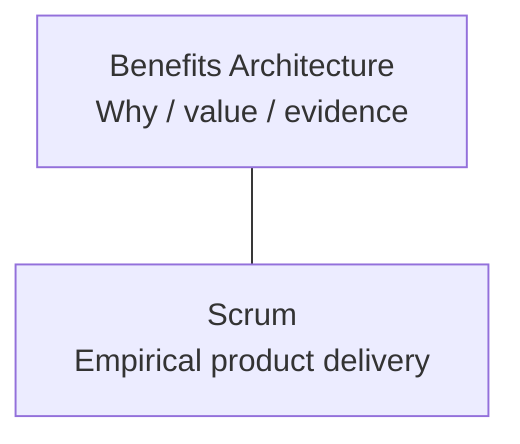
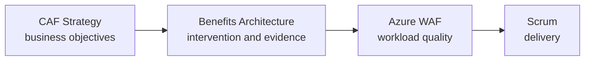
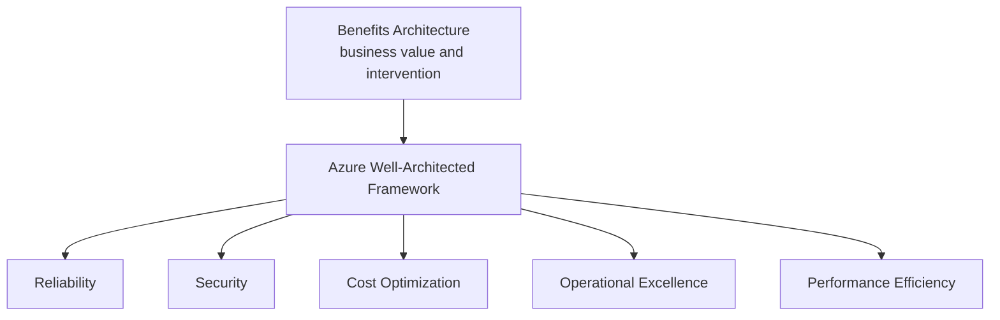

# Microsoft and Industry Framework Alignment

Benefits Architecture is intended to **complement**, not replace, established frameworks.

## Scrum

Scrum remains the delivery framework.

Benefits Architecture adds:

- benefit and outcome semantics above the Product Backlog;
- explicit causal hypotheses;
- value-aware architecture decisions;
- benefit observability;
- evidence that may influence Product Goal and backlog decisions.

It does not alter Scrum accountabilities, events, artefacts, or commitments.

Reference: [The Scrum Guide](https://scrumguides.org/scrum-guide.html).

## Scrum.org Evidence-Based Management

Evidence-Based Management is a strong conceptual neighbour because it emphasises improving outcomes, reducing risk, and optimising investment using evidence.

Benefits Architecture can use EBM as an empirical value-management lens while supplying more explicit architecture traceability.

Reference: [Evidence-Based Management Guide](https://www.scrum.org/resources/evidence-based-management-guide).

## UK Government Teal Book / Benefits Management

The Teal Book provides a mature end-to-end benefits-management frame.

Benefits Architecture aligns particularly well with its emphasis on:

- benefits as measurable value or positive impact arising from outcomes;
- explicit benefit owners;
- benefits mapping;
- two-way traceability between objectives, benefits, outcomes, and solution outputs;
- progressive and iterative assessment;
- uncertainty and ranges;
- benefits being realised progressively in iterative delivery.

Benefits Architecture narrows the concern to the **technology-to-value causal mechanism**, leaving wider governance and formal benefits-accountability structures intact.

Reference: [Teal Book Chapter 19 — Benefits management](https://projectdelivery.gov.uk/teal-book/home/part-e-planning-and-control/chapter-19-benefits-management/).

## Azure Cloud Adoption Framework

Cloud Adoption Framework Strategy explicitly links executive intent, measurable business outcomes, and cloud investment decisions.

Benefits Architecture can operate inside that strategic context at workload or product level.

Reference: [Cloud Adoption Framework — Strategy](https://learn.microsoft.com/en-us/azure/cloud-adoption-framework/strategy/).

## Azure Well-Architected Framework

Azure Well-Architected evaluates workload quality across:

- Reliability;
- Security;
- Cost Optimization;
- Operational Excellence;
- Performance Efficiency.

Benefits Architecture does not create a sixth WAF pillar.

Instead, it sits **outside** WAF and asks whether the workload being evaluated is the right intervention at all.

This preserves the distinction:

> **Benefits Architecture:** are we doing the right thing?

> **Well-Architected:** are we doing the chosen thing well?

Reference: [Azure Well-Architected Framework](https://learn.microsoft.com/en-us/azure/well-architected/).

## Power Platform Well-Architected

For Power Platform workloads, the same outer Benefits Architecture layer can surround Power Platform Well-Architected.

Its current pillars are:

- Reliability;
- Security;
- Operational Excellence;
- Performance Efficiency;
- Experience Optimization.

This is particularly useful when comparing a Power Platform intervention with a custom Azure solution. Benefits Architecture supplies the common value frame before workload-specific quality frameworks are applied.

Reference: [Power Platform Well-Architected](https://learn.microsoft.com/en-us/power-platform/well-architected/pillars).

## Practical rule

Do not force all frameworks into a single mega-model.

Use each for what it is good at:

| Concern | Primary framework |
|---|---|
| Organisational / programme benefit governance | Teal Book or client BRM framework |
| Product delivery | Scrum |
| Empirical value management | EBM |
| Cloud strategy / portfolio adoption | Azure Cloud Adoption Framework |
| Azure workload quality | Azure Well-Architected |
| Power Platform workload quality | Power Platform Well-Architected |
| Technology-to-value traceability and benefit observability | Benefits Architecture |
