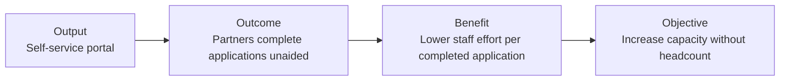

# Glossary

Consistent terminology is important because benefits work often fails when outputs, outcomes, capabilities, and benefits are treated as synonyms.

| Term | Working definition |
|---|---|
| **Objective** | A strategic or operational state the organisation intends to achieve or advance. |
| **Benefit** | Measurable value or positive impact arising from an outcome and contributing to an objective. |
| **Benefit Hypothesis** | A testable statement describing the expected benefit, causal assumptions, target, evidence, and conditions that would weaken or falsify the claim. |
| **Benefit Owner** | The named business or operational person accountable for realising and reporting a benefit. |
| **Outcome** | A changed state, behaviour, performance level, or user/operational result produced by change. |
| **Output** | Something delivered by the work, such as a service, system, API, workflow, migration, or capability implementation. |
| **Capability** | An ability that an organisation, user, process, or technology must possess in order to enable an outcome. |
| **Intervention** | A deliberate change intended to influence an outcome. It may be technological, process, organisational, policy, or a combination. |
| **Feature** | In this toolkit, a coherent product intervention intended to produce a measurable change in one or more agreed outcome measures. |
| **Enabler** | Work necessary to make another intervention possible, including platform, security, integration, data, operational, or architectural work. |
| **Disbenefit** | A measurable adverse effect arising from the change. |
| **Baseline** | Evidence describing the relevant current state before an intervention is assessed. |
| **Leading indicator** | Evidence expected to move before the final benefit can reasonably be observed. |
| **Lagging indicator** | Evidence of the later outcome or realised benefit. |
| **Benefit Observability** | The deliberate design of evidence across technical, adoption, behavioural, outcome, and benefit stages so that the value mechanism can be inspected. |
| **Value-aware ADR** | An Architecture Decision Record that considers outcome and benefit realisation alongside conventional technical quality and constraints. |
| **Evidence Log** | A concise record of material evidence, interpretation, confidence changes, and resulting decisions. |
| **Time-to-benefit** | Expected elapsed time from investment or delivery to meaningful value realisation. |
| **Time-to-evidence** | Expected elapsed time before an intervention can generate useful evidence about a material assumption. |
| **Reversibility** | The practical and economic ease with which a decision can be changed when evidence invalidates assumptions. |
| **Two-way traceability** | Ability to navigate both from objective down to solution/increment and from solution/increment back to the objective and benefit it serves. |

## Output, outcome, benefit example

## Benefit versus architecture quality

Benefits Architecture deliberately distinguishes:

- **value:** whether the intervention produces worthwhile outcomes;
- **quality:** whether the chosen workload meets the architectural qualities required of it.

A workload can be technically excellent and still be the wrong investment.
