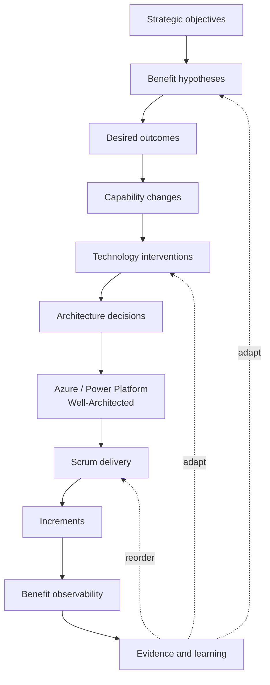

# Benefits Architecture Toolkit

> **Draft v0.1 — September 2026**

Benefits Architecture is a lightweight, Scrum-adjacent approach for making the causal link between **business objectives**, **benefit hypotheses**, **desired outcomes**, **technology interventions**, **architecture decisions**, **delivery increments**, and **observed evidence** explicit and testable.

It is intended primarily for technology consultants, solution architects, technical architects, Product Owners, delivery teams, and business stakeholders working on technology-enabled change.

It does **not** replace Scrum, benefits management, business analysis, enterprise architecture, or technology-specific architecture frameworks. It adds a thin value-and-evidence layer around them.

## The central proposition

> Architecture describes not only what a system will be, but the causal mechanism by which an investment in technology is expected to produce organisational value.

This leads to four practical questions:

1. **Why does the business objective require this technology intervention?**
2. **Why should this intervention cause the desired outcome?**
3. **How will we know whether the outcome and benefit are emerging?**
4. **Given what we now know, is this still the best intervention?**

## Position in the delivery landscape

Benefits Architecture sits **outside** workload-quality frameworks such as Azure Well-Architected.

- **Benefits Architecture:** are we investing in the right intervention, for the right outcome, with a credible and testable value argument?
- **Well-Architected:** are we designing and operating the chosen workload well?
- **Scrum:** are we empirically delivering and adapting the product effectively?

## Toolkit contents

- [Principles](./principles.md)
- [Operating Model](./operating-model.md)
- [Roles and Accountabilities](./roles-and-accountabilities.md)
- [Scrum Integration](./scrum-integration.md)
- [Microsoft and Industry Framework Alignment](./framework-alignment.md)
- [Engagement Playbook](./engagement-playbook.md)
- [Consulting Offering](./consulting-offering.md)
- [Maturity Model and Open Questions](./maturity-model.md)
- [Glossary](./glossary.md)
- [Worked Azure Example](./examples/external-partner-portal.md)

### Artefacts

1. [Objective and Benefits Map](./artefacts/01-objective-benefits-map.md)
2. [Benefit Hypothesis](./artefacts/02-benefit-hypothesis.md)
3. [Value-aware Architecture Decision Record](./artefacts/03-value-aware-adr.md)
4. [Benefit Observability Model](./artefacts/04-benefit-observability.md)
5. [Benefit-aware Backlog](./artefacts/05-benefit-aware-backlog.md)
6. [Benefit Evidence Log](./artefacts/06-benefit-evidence-log.md)

## Status

This is intentionally an initial working draft. It should be treated as a coherent hypothesis about how an architect-led benefits practice could work, not as a finished methodology.

The most important design constraint is **low ceremony**: if an artefact or practice does not improve a decision, traceability, learning, or accountability, it should be simplified or removed.
