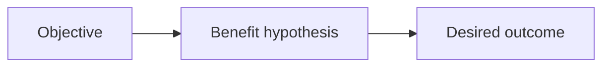
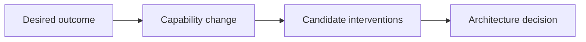
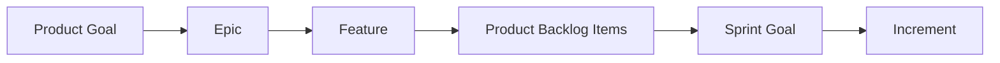
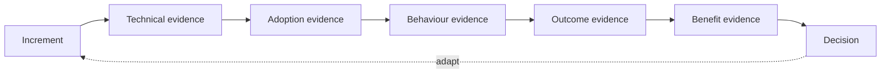
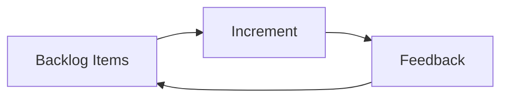
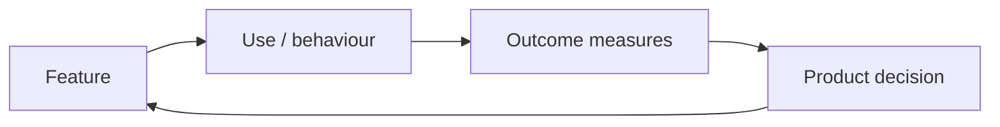
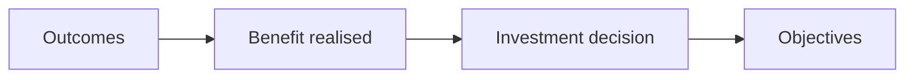

# Operating Model

Benefits Architecture is a **thin value-and-evidence layer** around an existing product and delivery model.

It contains four connected layers.

## Layer 1 — Value context

Defines why change is desirable.

Questions:

- What strategic or operational objective are we advancing?
- What measurable advantage would constitute success?
- Who owns that benefit?
- What outcome must change for the benefit to emerge?
- What assumptions connect the outcome to the benefit?

Primary artefacts:

- Objective and Benefits Map
- Benefit Hypothesis

---

## Layer 2 — Intervention context

Defines what could cause the desired outcome.

Questions:

- What capability or behaviour must change?
- Is technology necessary?
- What technology options exist?
- What is the simplest credible intervention?
- Which option best balances architecture quality, time-to-benefit, risk, cost, and learning?

Primary artefact:

- Value-aware ADR

---

## Layer 3 — Delivery context

Connects the chosen intervention to Scrum delivery.

Benefits Architecture does not prescribe this exact work-item hierarchy. Where Epics and Features are used, however:

- an Epic should represent a major objective, outcome area, or coherent investment theme;
- a Feature should represent a coherent intervention intended to change an outcome;
- PBIs express the work needed to deliver or learn about the Feature;
- the Sprint Goal should normally express the coherent outcome or capability being advanced.

Primary artefact:

- Benefit-aware Backlog

---

## Layer 4 — Evidence context

Tests whether the causal argument is surviving contact with reality.

Primary artefacts:

- Benefit Observability Model
- Benefit Evidence Log

---

## Three feedback loops

The model deliberately separates three cadences.

### Delivery loop — days to weeks

Primarily handled by Scrum.

### Product/outcome loop — weeks to months

This is where Benefits Architecture adds most day-to-day value.

### Strategic benefit loop — months to quarters

This involves benefit owners, sponsors, Product Owners, and other accountable stakeholders.

## Minimum lifecycle

A typical engagement moves through the following activities.

| Activity | Main question | Outputs |
|---|---|---|
| Frame | Why does this change matter? | Objectives, stakeholders, initial success measures |
| Model | How should value emerge? | Benefit map, hypotheses, dependencies |
| Baseline | What is true today? | Baselines, targets, evidence sources |
| Explore | What interventions could work? | Options, constraints, spikes |
| Decide | What should we invest in now? | Value-aware ADRs |
| Deliver | What is the smallest useful increment? | Features, Sprint Goals, increments |
| Observe | What changed? | Telemetry, operational and outcome evidence |
| Adapt | What does the evidence imply? | Reordered backlog, revised hypothesis or architecture |
| Sustain | Is the benefit continuing? | Operational ownership, longitudinal evidence |

The lifecycle is intentionally iterative. A team may revisit modelling, options, or baselines as evidence improves.
