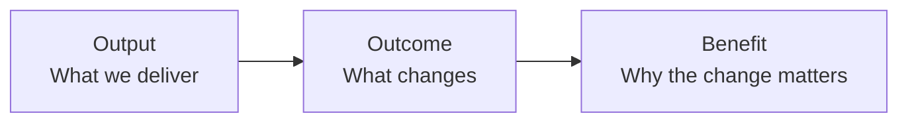

# Benefits Architecture Principles

These principles define the behaviour expected when applying Benefits Architecture. They are deliberately compatible with Scrum and mainstream architecture practice.

## 1. Start with value, not technology

Technology is an intervention, not an objective.

Do not begin with:

> We need Dynamics 365.

Begin with:

> What must become true that is not true today?

Technology choices should appear only after objectives, desired outcomes, constraints, and measurable benefits are sufficiently understood.

---

## 2. Benefits are hypotheses until evidenced

A forecast benefit is not a fact.

Prefer:

> We believe this intervention will reduce average processing effort by 30–40%, subject to the stated adoption and process assumptions.

over:

> This feature will save £400,000.

Use ranges, confidence, assumptions, and evidence where uncertainty is material.

---

## 3. Distinguish outputs, outcomes, and benefits

A delivered capability is not automatically a benefit.



Example:

- **Output:** automated routing capability.
- **Outcome:** work reaches an appropriately skilled agent without manual triage.
- **Benefit:** reduced handling effort and improved first-contact resolution.

---

## 4. Every material Feature must have an outcome

A Feature should normally be a coherent intervention intended to change one or more measurable outcomes.

No material Feature should be approved merely because it is technically desirable.

This does not require inventing financial value for every technical enabler. Technical work may contribute indirectly through a traceable dependency chain.

---

## 5. Architecture optimises value as well as technical quality

Architecture quality remains essential. Reliability, security, cost optimisation, operational excellence, performance, usability, compliance, and maintainability still matter.

Benefits Architecture adds further decision criteria such as:

- contribution to desired outcomes;
- time-to-benefit;
- benefit confidence;
- reversibility;
- cost of delay;
- measurement capability;
- learning speed.

A technically superior design is not necessarily the best investment.

---

## 6. Important benefits must be observable

For each material benefit chain, identify evidence for the intermediate causal steps.


If the team cannot observe whether these transitions occur, it will struggle to diagnose why a benefit failed to materialise.

---

## 7. Evidence may change architecture, not only backlog order

Agile feedback is not limited to changing Features and Stories.

Evidence may invalidate:

- a benefit assumption;
- a process assumption;
- an adoption assumption;
- an integration approach;
- a platform choice;
- a non-functional requirement;
- the entire intervention.

Architecture should remain deliberately adaptable where uncertainty is high.

---

## 8. Business owns benefits; architects own the integrity of the technology-to-value argument

Benefit ownership remains with an appropriately accountable business or operational owner.

The architect's responsibility is different:

> Ensure that the claimed relationship between technology intervention, capability, outcome, and benefit is coherent, explicit, testable, and supported by appropriate architecture and evidence.

---

## 9. Prefer the smallest intervention that can generate useful evidence

The useful minimum is not necessarily the smallest amount of software.

A Benefits Architecture interpretation of MVP is:

> **The smallest intervention capable of generating meaningful evidence about a material benefit hypothesis.**

This favours bounded experiments, reversible choices, incremental release, and explicit learning goals.

---

## 10. Preserve two-way traceability without creating bureaucracy

It should be possible to navigate:

```text
Objective → Benefit → Outcome → Capability → Feature → Increment
```

and in reverse:

```text
Increment → Feature → Capability → Outcome → Benefit → Objective
```

Do not require every User Story to carry a fabricated benefit value. Traceability should exist at the lowest level where it remains meaningful.
