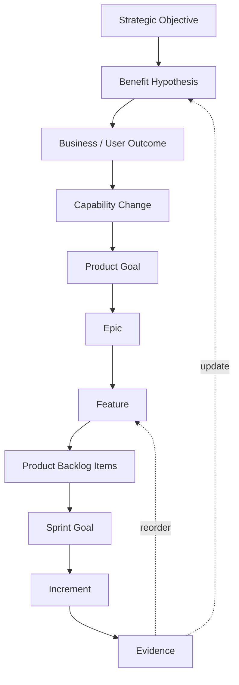

# Scrum Integration

Benefits Architecture should add as little ceremony as possible.

Scrum already supplies:

- Product Goal;
- Product Backlog;
- Sprint Goal;
- Increment;
- regular inspection and adaptation;
- Product Owner accountability for maximising value.

Benefits Architecture supplies additional semantics and evidence around those elements.

## Suggested hierarchy

This is a conceptual hierarchy. Teams should map it onto their existing tooling only where doing so creates useful transparency.

## Feature definition

A Benefits Architecture Feature is:

> **A coherent product intervention intended to produce a measurable change in one or more agreed outcome measures.**

A Feature should normally identify:

- the outcome it intends to influence;
- the benefit hypothesis to which it contributes;
- the principal users or actors affected;
- assumptions;
- leading evidence;
- target evidence;
- significant architecture dependencies;
- material disbenefits or risks.

### Feature readiness questions

Before substantial investment in a Feature:

1. Which outcome does this change?
2. Which benefit does that outcome contribute to?
3. What assumption are we making about causation?
4. What evidence would indicate that assumption is wrong?
5. Is this the cheapest, fastest, safest or most reversible credible intervention we currently know?
6. Can we deliver a smaller slice that produces useful evidence sooner?

## Sprint Goals

A Sprint should **preferably** advance one coherent Feature or a sensible slice of one, but this is not a rigid rule.

The stronger rule is:

> **The Sprint Goal should express the coherent outcome, capability, or learning objective being advanced rather than merely list work items.**

Less useful:

> Complete portal registration stories.

Better:

> Enable a partner to create and activate an account without staff intervention.

More empirical:

> Validate that partners can self-register without staff intervention, targeting at least 80% successful completion in the pilot cohort.

## Three Scrum-adjacent practices

### 1. Benefit Framing

Use during discovery, inception, or early Product Goal work.

Participants commonly include:

- Sponsor / Benefit Owner;
- Product Owner;
- Architect;
- operational SME;
- BA / service designer;
- analytics or finance specialists where needed.

Outputs:

- shared objective;
- benefit map;
- initial benefit hypotheses;
- owners;
- baselines or baseline gaps;
- key assumptions and disbenefits.

Rule: **prohibit solution names for the first part of the conversation**.

Ask:

> What must become true that is not true today?

before asking:

> Which technology should we use?

---

### 2. Benefit-aware Refinement

Do not create a separate recurring meeting if normal Product Backlog refinement can accommodate it.

At Feature level, review:

- outcome traceability;
- current confidence;
- evidence from previous increments;
- architecture assumptions;
- smallest useful next slice;
- whether the intervention remains the best available option.

This is also a suitable point for architecture spikes or option experiments.

---

### 3. Evidence in Sprint Review

Add a short evidence layer to the normal Sprint Review.

Discuss:

#### What did we deliver?

Demonstrate the usable increment.

#### What did we learn?

User, technical, operational and architecture learning.

#### What happened to our measures?

Report only evidence mature enough to be meaningful at this stage.

#### What changes because of this evidence?

Possible answers include:

- nothing;
- backlog order;
- scope of a Feature;
- Product Goal interpretation;
- benefit confidence;
- architecture;
- intervention choice.

## No orphan Features

Every material Feature should trace upward to an outcome and benefit.

This is acceptable:

The private endpoint does not require an invented standalone financial benefit.

## No orphan Benefits

Every material Benefit should have a credible downward path to:

- outcomes;
- capability or behavioural changes;
- interventions;
- Features;
- evidence.

A Benefit with no delivery or change mechanism is aspiration, not a plan.
