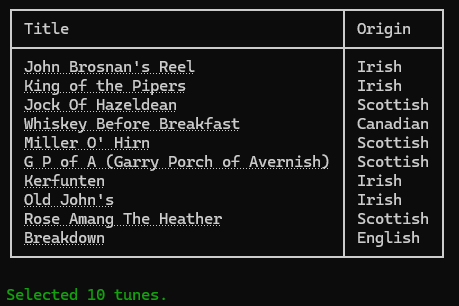

The `pick` command does not write back to your review database. It takes similar optional flags as are used in the [`review`](../review-command.mdx) command and presents you with a table of tunes that match the filters.

But you are not asked to review them interactively, and results are not saved to the review database.



:::tip Quick start

As a minimum, navigate to the root directory of your vault and run the following command:

```powershell
tune-review pick
```

:::