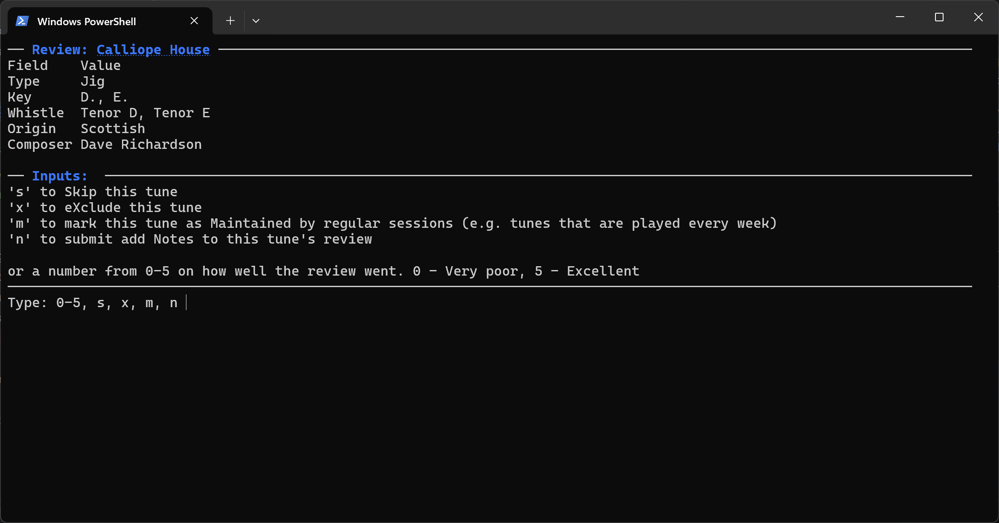

This is the primary command provided for reviewing tunes. By default, the CLI will select the 10 most "in need of revision" tunes and present them to you to review.



:::tip Quick start

As a minimum, navigate to the root directory of your vault and run the following command:

```powershell
tune-review review
```

:::